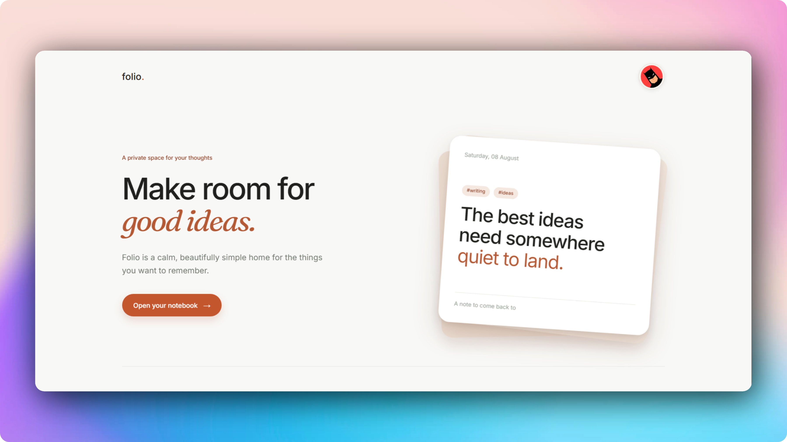
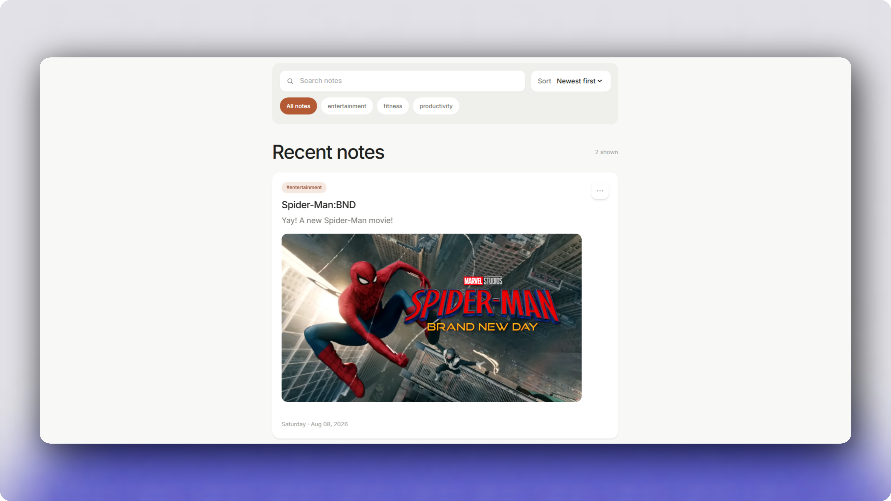

# Folio

> A quiet, private space for your ideas.

Folio is a privacy-first note-taking application designed around simplicity, ownership, and security. It provides a clean writing experience while ensuring every piece of user data—from notes and tags to uploaded images—remains isolated and protected through server-side authorization.

Built with the Next.js App Router, Prisma, PostgreSQL, and TypeScript, Folio focuses on modern full-stack development practices including secure authentication, protected API routes, automated testing, and production-ready deployment.





---

## Features

### Authentication

- Secure user registration and login
- JWT-based authentication using httpOnly cookies
- Password hashing with bcrypt
- Protected routes and middleware
- Persistent authenticated sessions

### Notes

- Create, edit and delete notes
- Search notes instantly
- Sort by newest and oldest
- Tag-based organization
- Dynamic timestamps
- Responsive interface

### Images

- Upload images directly into notes
- Private image ownership
- Secure access validation
- Vercel Blob Storage integration

### Personalization

- Pixel avatar selection
- Persistent avatar preferences
- Minimal, distraction-free interface

### Security

- Route authorization
- Ownership validation
- Protected uploads
- Server-side validation
- Input validation using Zod

---

# Tech Stack

## Frontend

- Next.js 14 (App Router)
- React 18
- TypeScript
- Tailwind CSS

## Backend

- Next.js Route Handlers
- Prisma ORM
- PostgreSQL (Neon)

## Authentication

- jose (JWT)
- bcryptjs

## Storage

- Vercel Blob Storage

## Validation

- Zod

## Testing

- Vitest

## Deployment

- Vercel

---

# Architecture

```
Browser
     │
     ▼
Next.js App Router
     │
     ├── Authentication (JWT)
     ├── Route Handlers
     ├── Middleware
     │
     ▼
Prisma ORM
     │
     ▼
PostgreSQL (Neon)

Uploads
     │
     ▼
Vercel Blob Storage
```

---

# Project Structure

```
app/
components/
lib/
prisma/
public/
tests/
```

| Folder | Purpose |
|---------|----------|
| app | App Router pages and API routes |
| components | Reusable UI components |
| lib | Authentication, database, validation and utilities |
| prisma | Database schema |
| public | Static assets |
| tests | Unit and API integration tests |

---

# Running Locally

Clone the repository

```bash
git clone <https://github.com/YK-03/Folio>
```

Install dependencies

```bash
npm install
cd Folio
```

Create a `.env` file from `.env.example` and configure:

```env
DATABASE_URL=
JWT_SECRET=
BLOB_READ_WRITE_TOKEN=
```

Generate Prisma Client

```bash
npx prisma generate
```

Sync the database

```bash
npx prisma db push
```

Start the development server

```bash
npm run dev
```

---

# Useful Commands

```bash
npm run dev
npm run build
npm run lint
npm run test
npm run test:coverage
npx prisma generate
npx prisma db push
```

---

# Database Design

The application consists of five primary models:

- User
- Note
- Tag
- NoteTag
- Image

### User → Note

One-to-many relationship.

Each note belongs to exactly one authenticated user.

Deleting a user automatically removes all associated notes.

### Note ↔ Tag

Many-to-many relationship implemented using an explicit join table.

Using an explicit join table keeps the relationship extensible and allows additional metadata to be added later without changing the overall schema.

### User → Tag

Tags are scoped per user.

Two users can each have a tag named "work" without conflicts.

### Images

Each uploaded image belongs to exactly one user and may optionally be associated with a note.

---

# Authentication & Security

Folio is designed around secure authentication and private ownership of user data.

Highlights include:

- Password hashing using bcrypt
- JWT authentication using jose
- Sessions stored in httpOnly cookies
- Edge-compatible authentication middleware
- Authorization performed inside database queries
- Ownership validation on every protected resource
- Per-user data isolation enforced across notes, tags, avatars, and uploaded images
- Uniform 404 responses to avoid resource enumeration
- Server-side input validation with Zod

---

# Testing

The project includes comprehensive automated tests covering both unit and integration scenarios.

Current status:

- 56 automated tests
- All tests passing

Coverage includes:

- Authentication
- Authorization
- Avatar persistence
- Image lifecycle
- Notes filtering
- Notes ownership
- Middleware
- API integration

Run the complete test suite:

```bash
npm run test
```

---

# Engineering Decisions

### Explicit Join Table

Instead of Prisma's implicit many-to-many relationships, Folio uses an explicit `NoteTag` model to provide greater flexibility and future extensibility.

### JWT + httpOnly Cookies

Authentication uses signed JWTs stored in httpOnly cookies rather than localStorage to reduce exposure to client-side JavaScript.

### Edge Compatibility

`jose` was selected over traditional JWT libraries because it works in both Route Handlers and Next.js Middleware.

### Ownership Validation

Protected resources are queried using both the resource ID and authenticated user ID in the database query itself, ensuring users cannot access or infer the existence of another user's data.

---

# Trade-offs

Some deliberate decisions were made to keep the project focused.

- Authentication does not include email verification.
- Authentication endpoints are not rate-limited.
- Pagination has not yet been implemented.
- Notes are refetched after mutations rather than using optimistic updates.
- Full accessibility auditing remains future work.

These choices keep the project focused while leaving clear paths for future improvements.

---

# Future Improvements

Potential areas for expansion include:

- Rich text editing
- Markdown support
- Dark mode
- Collections and folders
- Favorites
- Offline support
- Full-text search
- AI-assisted writing
- Note version history
- Collaborative note sharing

---

# Development Process

Folio was developed with an emphasis on maintainability, correctness, and iterative refinement.

AI-assisted tools were used to accelerate implementation of repetitive tasks such as boilerplate generation, schema scaffolding, and test setup. All architectural decisions, debugging, security considerations, and final code review were performed manually, with generated code reviewed and refined before being incorporated into the project.

---

# License

Copyright © 2026 Yash Kaushik.

All Rights Reserved.
